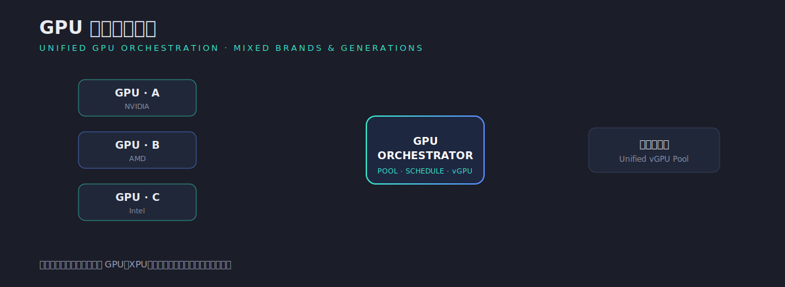

  

  <b>將 AI 從原型，帶到生產規模。</b> 
  大多數組織都能建構 AI 原型，但遠少數能在生產環境中高效部署、運行並擴展 AI。 
  <b>Phison AI Data Platform</b> 把基礎設施、資源管理、AI 中介軟體與應用服務整合為單一平台， 
  協助企業加快部署、提升 GPU 利用率，並降低大規模運行 AI 的成本與複雜度。

  <a href="https://phison-ai-data-platform.pages.dev/">官方網站</a> ·
  <a href="https://phison-ai-data-platform.pages.dev/contact/">聯絡我們</a> ·
  <a href="https://github.com/orgs/aiDAPTIV-Phison/discussions">討論區</a> ·
  <a href="https://github.com/aiDAPTIV-Phison">GitHub</a>

 

  

---

## 為什麼需要它？— 企業 AI 的現實

> 企業在邁向私有化 AI 的道路上，最常面臨的阻礙。

| 角色 | 心聲 | 核心痛點 |
| :-- | :-- | :-- |
| **IT / 資料中心總監** 基礎設施維運 | _「管理獨立的 GPU 機架、儲存陣列與交換器，正把我的團隊逼到極限。」_ | 運算、儲存、網路三套系統各需專屬團隊；6–9 個月採購週期跟不上業務擴張；容量規劃 over／under-provision 兩難。 |
| **CTO / 技術長** 私有 LLM 策略 | _「我們想要私有 LLM，但複雜度與前期成本讓我們動彈不得。」_ | 公有雲 API 在量產規模超出預算、敏感資料不能出境；缺乏內部 GPU 工程師，外包又面臨廠商鎖定。 |
| **金融 / 醫療** 合規與資料主權 | _「合規團隊否決了雲端 AI，我們陷入停擺。」_ | GDPR 與醫療隱私法要求本地推論；每次推論需完整稽核日誌；通過 ISO 27001 / SOC 2 使外部服務難以獲批。 |
| **研究機構 / 大學** 共享 GPU 叢集 | _「研究人員在 GPU 佇列中等待數天，科學不等人。」_ | 共享佇列使實驗週期延長 3–5 倍；TB 級資料集觸及儲存吞吐上限；補助導向採購與基礎設施生命週期脫節。 |

---

## 平台價值

<table>
<tr>
<td width="33%" valign="top">

### ⚡ Day 1 Ready · 開機即用
不只是一台伺服器，更是開箱即用的完整 AI 部門。從基礎架構到應用程式皆可無縫擴充，省去數月繁雜的系統整合。

</td>
<td width="33%" valign="top">

### 💰 1/10 Cost · 硬體預算
Phison 獨創 **Pascari aiDAPTIV™** 技術，以 1/10 的硬體成本提供安全、企業級的 LLM 微調與推理，讓各規模企業皆能輕鬆擁抱 AI。

</td>
<td width="33%" valign="top">

### 🔍 Ask AI Anywhere · 詢問 AI
數據原地不動、安全無虞。零遷移架構支援以自然語言直接查詢分散數據，無需搬移即可即時獲取商業洞察。

</td>
</tr>
</table>

---

## 平台架構

  

企業可依自身 AI 應用需求、既有 IT 環境與預算規模，**彈性選擇並自由組合**最合適的硬體設備、AI 模組與應用服務，快速打造可擴充、可管理、可商業化的地端 AI 基礎平台。

| 層級 | 名稱 | 內容 |
| :--: | :-- | :-- |
| **L4** | 可複用 AI 模組層 | 視覺、語音、推理模組 · 資料橋接 · MLOps / LLMOps |
| **L3** | 可複用開源元件層 | aiDAPTIV AI 框架 · 訊息佇列 · 資料庫 · 網路 · 監控 · AI 模型 |
| **L2** | 超融合基礎架構軟體層 | Phison HCI — 容器管理 · GPU 虛擬化 · 資源排程 · 儲存 / 成本 / 監控 / 權限 |
| **L1** | 基礎設施層 | 高速互連整合 GPU · CPU · Cache · Storage |

> 同一平台可從**邊緣站點**延伸至**中央資料中心**一致部署，依序擴充四層而無需重新設計整體架構。

---

## GPU 算力統一管理

  

企業 AI 環境常面臨 GPU 資源分散、異質設備整合困難。Phison AI Data Platform 可**集中管理不同品牌與世代的 GPU／XPU**，池化為統一資源池，提升整體利用率與可擴充性。

---

## 可量化的成果

  

- **並發使用者容量 > 2×** — 相同 GPU 叢集，細粒度排程在不增加 GPU 的前提下最大化吞吐量。
- **首字延遲 (TTFT) 快 5 倍以上** — 叢集共享 KV cache，命中即返取代重算。
- **部署成本下降 61%** — aiDAPTIV 降低對高階 GPU 的依賴與 VRAM 浪費，維持吞吐的同時削減成本。
- **硬體成本 1/10** — 企業級 LLM 微調與推理，民主化 AI。

---

## 技術焦點 — Pascari aiDAPTIV™

**aiDAPTIV Cache Memory** 將 AI 有效記憶體擴展到 GPU 記憶體、系統記憶體與快閃記憶體，支援更大的模型、更長的上下文窗口、KV 快取重用，以及記憶體密集型 AI 工作負載。

| | 傳統架構 | aiDAPTIV 架構 |
| :-- | :-- | :-- |
| 記憶體層級 | HBM / GDDR → DRAM → SSD | HBM / GDDR → DRAM → **aiDAPTIV Cache** → SSD |
| 有效 AI 記憶體 | 受 GPU VRAM 限制 | 跨 GPU／系統／快閃延伸 |
| 適用 | 一般模型 | 大模型、長上下文、KV cache 重用 |

---

## 生態系與應用服務

整合 ISV、SI、開源元件與 AI 生態系夥伴，加速企業 AI 商業化與落地。

**原生應用與夥伴：** WrenAI（生成式 BI）· SecureMeet · digiRunner · SysTalk.VIKI · OrientAI · Phison Agentic Hub

| 部署模式 | 內容 |
| :-- | :-- |
| **SaaS** | 對話式分析 · 視覺化儀表板 · Slack / Teams 嵌入 · 嵌入式 AI 應用 |
| **PaaS** | 可複用 AI 模組層（L4）· 可複用開源元件層（L3）|
| **IaaS** | CPU / GPU / Cache / Storage Server（L1）|

---

## 適用對象

<table>
<tr>
<td valign="top">

**大型企業** 任務關鍵等級規模
- 金融服務
- 高科技製造
- 醫療產業
- 政府機關
- 電信產業
- 大型資料中心

</td>
<td valign="top">

**中小型組織** 為速度而生
- AI 新創
- 系統整合商 / 軟體商
- 中小企業 AI 導入
- AI Agent / GenAI 應用開發

</td>
<td valign="top">

**常見應用場景** 量產實證
- 企業私有 AI
- 生成式 AI 平台
- AI 智能代理 · RAG 搜尋
- AI 會議助理 · 視覺辨識
- AI 推論 / 邊緣運算

</td>
</tr>
</table>

---

## 產品線

| 產品 | 說明 |
| :-- | :-- |
| [**GPU Server**](https://phison-ai-data-platform.pages.dev/gpu-server/) | 搭載 aiDAPTIV 技術的 AI 訓練與推理伺服器 |
| [**Cache Server**](https://phison-ai-data-platform.pages.dev/cache-server/) | GPU 叢集共享 KV cache 儲存池 |
| [**Storage Server**](https://phison-ai-data-platform.pages.dev/storage-server/) | Block / File / S3 物件存取 AI 儲存平台 |
| [**HCI 超融合**](https://phison-ai-data-platform.pages.dev/hci/) | 超融合運算、儲存與 AI 推論服務 |
| [**Capacity Explorer**](https://phison-ai-data-platform.pages.dev/solutions/capacity-explorer/) | 容量規劃解決方案 |

---

## 連結

- 🌐 官方網站 — <https://phison-ai-data-platform.pages.dev/>
- 🤝 群聯生態系 — <https://phison-ai-data-platform.pages.dev/ecosystem/>
- 🌏 AISO 聯盟 — <https://phison-ai-data-platform.pages.dev/aiso/>
- 💬 討論區 — <https://github.com/orgs/aiDAPTIV-Phison/discussions>
- 📨 聯絡銷售 — <https://phison-ai-data-platform.pages.dev/contact/>
- 🏢 群聯電子 — <https://www.phison.com>

---

© Phison Electronics. All rights reserved. 群聯電子。保留所有權利。 
本 README 的橫幅與圖示皆為動態 SVG（CSS 動畫），在 GitHub 上會自動播放。
